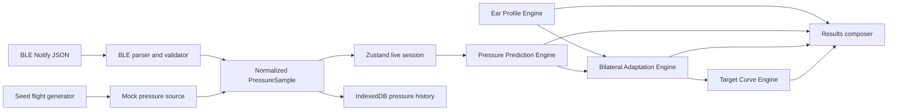

# AeroBalance PWA Design Specification

**Date:** 2026-06-14  
**Project:** 面向环境压力梯度变化的耳膜动态调控与保护系统  
**English name:** Dynamic Tympanic Pressure Regulation and Protection System

## GOAL

Build a mobile-first bilingual PWA demonstration that lets an exhibition judge understand the core value chain in under three minutes:

`Personal Ear Profile -> Pressure Prediction -> Bilateral Adaptation -> Target Pressure Curve`

The application connects to an ESP32-C3 through Web Bluetooth when hardware is available and runs the identical product flow with deterministic, high-quality seed data when it is not.

## CONTEXT

The repository is empty and has no legacy architecture to preserve. The product is an invention exhibition and patent-system validation prototype, not a medical product or a native mobile application. Its success depends on visual credibility, a coherent live demonstration, resilient local operation, and clear separation of business logic from presentation.

The UI should feel comparable in polish and restraint to Apple Health, Oura Ring, WHOOP, and DJI Fly without copying their proprietary layouts or assets.

## CONSTRAINTS

- Use Next.js App Router, TypeScript, Tailwind CSS, Recharts, Zustand, IndexedDB/localStorage, and PWA support.
- Use no backend, fake remote API, medical diagnosis language, or hardcoded analysis result.
- Web Bluetooth is available only through a supported Chromium browser in a secure context such as HTTPS or localhost.
- Every hardware-dependent path must have an equivalent mock-mode path.
- All analysis must be generated from profile and pressure inputs by testable pure functions.
- Chinese and English must be switchable on every route.
- The primary layout target is a mobile viewport; desktop layouts may expand but must not change the workflow.
- Core actions must be comfortably tappable during a live presentation.
- The result vocabulary is limited to comfort, pressure adaptation, risk indication, and adaptation recommendations.

## DONE WHEN

- All eight routes render as a coherent premium product experience.
- A judge can complete the guided demo in under three minutes without hardware.
- The simulator can switch among takeoff, cruise, descent, and landing.
- Valid BLE notifications update the same pressure history consumed by mock mode.
- Invalid BLE data and device failures do not crash the application.
- Ear profile, prediction, bilateral strategy, target curve, comfort score, and risk level are computed from independent engines.
- PDF-print and JSON report exports work from the results route.
- The app is installable, provides an offline application shell, and is usable after the first successful load.
- Unit, component, build, and end-to-end checks pass.

---

## 1. Product Narrative

### 1.1 Three-minute guided demonstration

The primary action, **Start Demo**, starts a guided session rather than dropping the judge into a dashboard.

1. **0:00-0:25 - Profile:** Select seeded User A and generate a visibly asymmetric ear profile.
2. **0:25-0:55 - Flight:** Enter the descent phase and watch cabin pressure rise in real time.
3. **0:55-1:25 - Prediction:** Show historical pressure extending into a 5/10/15-minute forecast while target pressure responds more smoothly.
4. **1:25-1:55 - Strategy:** Reveal separate left and right decision paths, levels, and smoothing factors.
5. **1:55-2:25 - Target curve:** Compare environmental pressure with both target-ear curves.
6. **2:25-3:00 - Results:** Present comfort, risk, recommendations, and report export.

Every guided route has one dominant message, one dominant visualization, and a sticky primary next action. Device connection remains available but is not required in the guided flow.

### 1.2 Product language

Allowed:

- Comfort Score / 舒适度评分
- Risk Level / 风险等级
- Pressure Adaptation / 压力适应
- Adaptation Recommendation / 适应建议
- Sensitivity / 敏感度
- Pressure Stress / 压力应力

Disallowed:

- Diagnosis, treatment, cure, disease determination, or clinical claims
- Statements that the system prevents injury or guarantees physiological outcomes

A persistent footer note states that this is a pressure-adaptation demonstration and not medical advice.

---

## 2. Application Architecture

### 2.1 Runtime layers

1. **Presentation layer**
   - Next.js App Router pages and reusable React components.
   - Tailwind CSS design tokens and responsive layouts.
   - Recharts for line, area, and radar visualizations.

2. **Session layer**
   - A single Zustand store owns locale, profile, simulator state, device state, session state, and the latest derived result.
   - Store actions accept normalized domain objects rather than raw BLE strings.
   - Durable user settings and current profile are persisted to localStorage.

3. **Domain engine layer**
   - `Ear Profile Engine`
   - `Pressure Prediction Engine`
   - `Bilateral Adaptation Engine`
   - `Target Curve Engine`
   - All engines are pure TypeScript modules with no React, browser, storage, or Bluetooth dependency.

4. **Data-source layer**
   - `MockPressureSource` and `BluetoothPressureSource` implement the same start/stop/sample callback contract.
   - Both produce validated `PressureSample` objects.
   - Samples are appended to the in-memory store immediately and persisted to IndexedDB asynchronously.

5. **Persistence and report layer**
   - IndexedDB stores pressure sessions and samples.
   - localStorage stores small settings and profile state.
   - JSON export serializes current inputs and computed output.
   - PDF export opens a print-optimized report document and invokes the browser print dialog, preserving bilingual text without shipping a large PDF-font dependency.

### 2.2 Proposed source structure

```text
src/
  app/
    device/page.tsx
    flight/page.tsx
    prediction/page.tsx
    profile/page.tsx
    results/page.tsx
    strategy/page.tsx
    target-curve/page.tsx
    globals.css
    layout.tsx
    manifest.ts
    page.tsx
    report/print/page.tsx
  components/
    charts/
      EarComparisonChart.tsx
      PressureChart.tsx
      PredictionChart.tsx
      TargetCurveChart.tsx
    device/
      DeviceStatus.tsx
    layout/
      AppHeader.tsx
      BottomNavigation.tsx
      DemoProgress.tsx
      LanguageToggle.tsx
    profile/
      EarComparisonVisual.tsx
      ProfileForm.tsx
    strategy/
      StrategyCard.tsx
      StrategyDecisionFlow.tsx
    ui/
      ActionButton.tsx
      MetricCard.tsx
      Notice.tsx
      RiskBadge.tsx
      ScoreRing.tsx
  config/
    bluetooth.ts
  lib/
    bluetooth.ts
    profile.ts
    prediction.ts
    report.ts
    seed.ts
    storage.ts
    strategy.ts
    target-curve.ts
  store/
    useAppStore.ts
  types/
    domain.ts
  i18n/
    messages.ts
  sw.ts
```

The final structure may combine very small UI files, but domain engine files remain separate.

### 2.3 Data flow



Mock and hardware samples are deliberately indistinguishable after normalization. This prevents the demo path from becoming a separate, less-tested implementation.

---

## 3. Page Specification

### 3.1 Global shell

- Header: compact wordmark, connection indicator, locale toggle, and overflow navigation.
- Mobile bottom navigation: Home, Flight, Strategy, Results.
- Guided-flow pages: thin progress bar showing Profile, Flight, Predict, Strategy, Curve, Result.
- Sticky bottom action: one primary next step and at most one secondary action.
- Toast/notice region: recoverable device, parser, and persistence messages.
- Global demo state survives route changes and page refreshes.

### 3.2 Home `/`

**Purpose:** Establish premium product credibility and communicate the system state within five seconds.

**Hero section:**

- Product name and short bilingual value statement.
- A large animated pressure-orbit visualization, not a dashboard table.
- Four live hero metrics:
  - Current Comfort Score
  - Current Risk Level
  - Current Flight Phase
  - Current Environmental Pressure
- Metrics initially use the deterministic User A descent snapshot and update when a session is active.
- Primary CTA: Start Demo.
- Secondary CTA: Connect Device.

**Capability story:**

- Three editorial cards: Ear Profile, Pressure Prediction, Bilateral Adaptation.
- Each card uses one concise sentence and a custom data visualization detail.
- A final horizontal narrative strip shows `Profile -> Predict -> Decide -> Adapt`.

**Visual rule:** No sidebar, dense metric grid, admin-table treatment, or developer console styling.

### 3.3 Device Connection `/device`

**Purpose:** Connect ESP32-C3 or enter the identical flow through mock mode.

- Status states: unsupported, disconnected, scanning, connecting, connected, failed, disconnected unexpectedly.
- Actions:
  - Scan ESP32-C3
  - Disconnect
  - Use Mock Data
- Connected details:
  - Device name
  - Service UUID
  - Characteristic UUID
  - Last sample timestamp
  - Battery and temperature when available
- Unsupported message:
  - Chinese: 当前浏览器不支持 Web Bluetooth，请使用 Chrome / Edge 或 Android Chrome，或启用模拟模式。
  - English equivalent.
- Failed and cancelled requests remain recoverable; the mock-data action is always visible.
- BLE actions are performed only from a direct user gesture.

### 3.4 Ear Profile `/profile`

**Purpose:** Turn a small number of user inputs into an immediately understandable bilateral profile.

**Inputs:**

- Age
- Rhinitis/congestion: none, mild, noticeable
- Previous flight ear discomfort: 0-10
- Equalization ability: 1-5
- Left sensitivity: 1-5
- Right sensitivity: 1-5
- Flight frequency: rare, occasional, frequent

**Seed profiles:**

- User A: sensitive left ear, normal right ear, mild rhinitis, strong landing discomfort.
- User B: both ears normal, frequent flyer, strong adaptation.
- User C: sensitive right ear, weak equalization, high pressure-change risk.

**Visualization:**

- A centered bilateral ear comparison visual uses two pressure rings whose radius, glow, and color reflect each risk score.
- A radar chart compares left and right across sensitivity, equalization burden, discomfort history, congestion influence, and adaptation capacity.
- Result cards show left risk, right risk, tolerance, and adaptation speed.
- The form supports fine adjustment but never visually dominates the comparison.

**Actions:** Generate Ear Profile, Continue to Flight.

### 3.5 Flight Pressure `/flight`

**Purpose:** Make environmental pressure change tangible and controllable.

**Flight Simulator:**

- Four large segmented controls: Takeoff, Cruise, Descent, Landing.
- Switching a phase loads the corresponding deterministic segment and starts playback.
- Controls: play/pause, restart phase, speed 1x/4x.
- Default guided-demo phase: Descent.

**Metrics:**

- Current pressure in kPa
- Pressure change rate in kPa/min
- Current phase
- Data source: BLE or Demo
- Battery and temperature when present

**Visualization:**

- Full-width environmental pressure area/line chart.
- Phase boundaries are softly annotated.
- Current sample has a moving focus point.
- The chart retains enough preceding context to make rate and direction obvious.

### 3.6 Pressure Prediction `/prediction`

**Purpose:** Demonstrate the shift from passive response to active prediction.

**Metrics:**

- Predicted pressure at +5, +10, and +15 minutes
- Pressure Stress Index
- Trend: rising, stable, or falling
- Prediction confidence

**Dynamic comparison:**

- Historical environmental pressure is a solid line.
- Forecast environmental pressure is a dashed line.
- Target pressure is a luminous smooth line.
- A moving time cursor animates through forecast points so the environmental-versus-target gap is visibly created over time.
- Left and right target curves may be toggled; the more sensitive ear is selected by default.
- The animation restarts when phase, profile, or prediction changes and respects reduced-motion preferences.

**Empty state:** Explain that at least three pressure samples are required and offer Start Demo Data.

### 3.7 Bilateral Strategy `/strategy`

**Purpose:** Make independent left/right decision-making explicit rather than merely displaying two scores.

**Two strategy cards:**

- Left Ear Strategy
- Right Ear Strategy

Each card shows a short decision flow:

`Ear Risk -> Pressure Stress -> Adaptation Level -> Smoothing Factor -> Recommendation`

Each card includes:

- Risk score
- Shared Pressure Stress Index
- Adaptation Level 1-5
- Smoothing factor
- Plain-language strategy explanation
- Direction indicator showing why the result differs from the other ear

If the risk-score difference is at least 15 points or the levels differ, show:

> 检测到左右耳适应差异，建议启用双耳独立策略。  
> Bilateral adaptation difference detected. Independent ear strategies are recommended.

**Guard:** If no profile exists, show a focused empty state with Create Profile and Load Demo Profile actions.

### 3.8 Target Curve `/target-curve`

**Purpose:** Visualize the proposed pressure adaptation output.

- Three synchronized curves:
  - Environmental Pressure
  - Left Target Curve
  - Right Target Curve
- Environmental pressure is visually dominant but thinner; target curves are smoother and color-coded by ear.
- A difference band highlights the adaptation gap without implying a clinical outcome.
- Metric cards show maximum change rate and average curve lag for each ear.
- Explanatory copy:
  - The target curve represents how the system proposes that ear-side pressure change more smoothly, reducing abrupt pressure-change impact in the demonstration model.

### 3.9 Results `/results`

**Purpose:** Summarize the entire reasoning chain in one exhibition-ready result.

- Large Comfort Score ring.
- Risk Level badge: Low, Medium, or High.
- Bilateral summary with left/right level, smoothing factor, and conclusion.
- Three personalized Adaptation Recommendations, derived from the actual scores and phase.
- Compact provenance row: selected profile, pressure source, sample count, analysis timestamp.
- Actions:
  - Export PDF Report
  - Export JSON
  - Restart
- PDF action opens `/report/print` in a print-ready layout and invokes browser printing for Save as PDF.
- JSON action downloads a versioned UTF-8 report document.
- Restart clears the active session while retaining locale and optional saved profiles.

---

## 4. Business Logic Specification

All numeric output is deterministic, clamped to documented ranges, and rounded only for presentation.

### 4.1 Shared types

```ts
type FlightPhase = "takeoff" | "cruise" | "descent" | "landing" | "demo";
type RiskLevel = "low" | "medium" | "high";
type Locale = "zh-CN" | "en";

interface PressureSample {
  id: string;
  sessionId: string;
  pressure: number;
  temperature?: number;
  battery?: number;
  phase: FlightPhase;
  timestamp: number;
  source: "bluetooth" | "mock";
}

interface EarProfileInput {
  age: number;
  congestion: "none" | "mild" | "noticeable";
  previousDiscomfort: number;
  equalizationAbility: number;
  leftSensitivity: number;
  rightSensitivity: number;
  flightFrequency: "rare" | "occasional" | "frequent";
}
```

### 4.2 Ear Profile Engine

Inputs are normalized to 0-100:

- `sensitivityBurden = (sensitivity - 1) / 4 * 100`
- `equalizationBurden = (5 - equalizationAbility) / 4 * 100`
- `discomfortBurden = previousDiscomfort / 10 * 100`
- `congestionBurden = none: 0, mild: 45, noticeable: 85`
- `ageBurden = 20` for age under 12, `15` for age over 60, otherwise `0`

Per-ear risk:

```text
EarRisk =
  sensitivityBurden * 0.35 +
  equalizationBurden * 0.25 +
  discomfortBurden * 0.20 +
  congestionBurden * 0.12 +
  ageBurden * 0.08
```

Clamp `EarRisk` to 0-100.

Tolerance:

```text
ToleranceScore =
  100 -
  mean(LeftRisk, RightRisk) * 0.55 -
  equalizationBurden * 0.30 -
  discomfortBurden * 0.15
```

Adaptation speed:

```text
FrequencyBenefit = rare: 15, occasional: 55, frequent: 90

AdaptationSpeed =
  equalizationAbilityNormalized * 0.50 +
  FrequencyBenefit * 0.30 +
  (100 - discomfortBurden) * 0.20
```

Both results are clamped to 0-100. Output includes the five radar dimensions for each ear.

### 4.3 Pressure Prediction Engine

Requirements:

- Require at least three samples.
- Sort and de-duplicate by timestamp.
- Use the most recent 20 samples, or all available samples when fewer.
- Convert timestamps to elapsed minutes.
- Fit ordinary least-squares linear regression to pressure versus elapsed minutes.
- Emit one forecast point per minute through +15 minutes.
- Clamp predicted pressure to 72-103 kPa to avoid physically implausible display overshoot.
- Extract headline values at +5, +10, and +15 minutes.

Trend:

- Rising if slope is greater than `+0.05 kPa/min`.
- Falling if slope is less than `-0.05 kPa/min`.
- Stable otherwise.

Confidence:

```text
SampleConfidence = min(sampleCount / 12, 1)
FitConfidence = clamp(RSquared, 0, 1)
Confidence = (SampleConfidence * 0.4 + FitConfidence * 0.6) * 100
```

Pressure Stress Index:

```text
RateStress = clamp(abs(slope) / 1.2 * 100, 0, 100)
ForecastStress = clamp(abs(P15 - CurrentPressure) / 12 * 100, 0, 100)
VolatilityStress = clamp(sampleStandardDeviation / 1.5 * 100, 0, 100)

PressureStressIndex =
  RateStress * 0.55 +
  ForecastStress * 0.30 +
  VolatilityStress * 0.15
```

### 4.4 Bilateral Adaptation Engine

For each ear:

```text
CombinedBurden = EarRisk * 0.60 + PressureStressIndex * 0.40
```

Adaptation level:

- Level 1: burden below 20
- Level 2: 20-39.99
- Level 3: 40-59.99
- Level 4: 60-79.99
- Level 5: 80 or above

Smoothing factor:

```text
SmoothingFactor =
  clamp(0.14 + (Level - 1) * 0.13 + EarRisk / 100 * 0.08, 0.14, 0.74)
```

Higher levels produce a higher smoothing factor and therefore a slower target-pressure response.

Independent strategy is active when:

- `abs(LeftRisk - RightRisk) >= 15`, or
- left and right adaptation levels differ.

Recommendations are selected from a finite bilingual rule set based on phase, level, trend, and asymmetry. They describe monitoring, gradual adaptation, and independent ear settings; they never diagnose or prescribe.

### 4.5 Target Curve Engine

For each ear:

```text
TargetPressure(t) =
  PreviousTargetPressure +
  (EnvironmentalPressure(t) - PreviousTargetPressure) *
  (1 - SmoothingFactor)
```

Rules:

- Initialize the first target value to the first environmental pressure.
- Run the complete combined historical and predicted sequence independently for each ear.
- Preserve timestamps and phase metadata.
- Compute maximum target change rate, mean absolute environmental-target gap, and final target pressure.
- No curve point is manually hardcoded; all points derive from environmental samples and smoothing factors.

### 4.6 Comfort and risk result

```text
LeftBurden = LeftRisk * 0.60 + PressureStressIndex * 0.40
RightBurden = RightRisk * 0.60 + PressureStressIndex * 0.40
AsymmetryPenalty = min(abs(LeftBurden - RightBurden) * 0.15, 10)

ComfortScore =
  clamp(100 - max(LeftBurden, RightBurden) * 0.85 - AsymmetryPenalty, 0, 100)
```

Overall risk follows the worse-ear burden:

- Low: below 35
- Medium: 35-64.99
- High: 65 or above

### 4.7 Seed data generation

Seed data is deterministic and generated from formulas rather than copied flat arrays.

- Takeoff: 101.3 to 78.0 kPa over 22 simulated minutes with eased decline and subtle deterministic cabin-control oscillation.
- Cruise: 78.0 kPa around a +/-0.18 kPa stable band over 36 minutes.
- Descent: 78.0 to 98.5 kPa over 20 minutes with a steeper middle segment.
- Landing: 98.5 to 101.3 kPa over 8 minutes with settling oscillation.
- Samples are emitted every simulated 30 seconds.
- Temperature varies smoothly from 24.8 to 25.6 C.
- Battery begins at 87% and decreases only at deterministic interval boundaries.
- The default guided session begins in descent with enough preceding samples for immediate prediction.

Playback speed changes emission timing only; it does not change timestamps or computed slopes.

---

## 5. Database Schema

### 5.1 IndexedDB

Database name: `aerobalance`  
Version: `1`

#### Object store `sessions`

Key path: `id`

```ts
interface PressureSessionRecord {
  id: string;
  startedAt: number;
  endedAt?: number;
  source: "bluetooth" | "mock";
  profileId?: string;
  deviceName?: string;
  seedId?: "user-a" | "user-b" | "user-c";
}
```

Indexes:

- `startedAt`
- `source`

#### Object store `pressureSamples`

Key path: `id`

```ts
interface PressureSampleRecord extends PressureSample {}
```

Indexes:

- `sessionId`
- `timestamp`
- compound `[sessionId, timestamp]`

Retention:

- Keep the latest 20 sessions.
- Remove older sessions on a best-effort cleanup after a new session starts.
- Keep at most 2,000 samples per session.

### 5.2 localStorage

Key: `aerobalance:settings:v1`

```ts
interface PersistedSettings {
  locale: Locale;
  reducedMotionOverride?: boolean;
  lastSeedId?: "user-a" | "user-b" | "user-c";
}
```

Key: `aerobalance:profile:v1`

```ts
interface PersistedProfile {
  id: string;
  name: string;
  input: EarProfileInput;
  result: EarProfileResult;
  updatedAt: number;
}
```

Large pressure arrays are never written to localStorage.

### 5.3 Zustand session state

The store contains only the active working set:

- locale and selected seed
- current profile and derived profile result
- device connection state and metadata
- simulator phase, speed, and playback state
- active session metadata
- recent pressure history capped at 360 points
- latest prediction, strategies, target curves, and result
- recoverable notice queue

Derived results are recalculated when relevant inputs change. They may be included in exports but are not treated as authoritative persisted source data.

---

## 6. BLE Protocol Design

### 6.1 Configuration

`src/config/bluetooth.ts`

```ts
export const DEVICE_NAME_PREFIX = "AeroBalance";
export const SERVICE_UUID = "0000ffe0-0000-1000-8000-00805f9b34fb";
export const CHARACTERISTIC_UUID = "0000ffe1-0000-1000-8000-00805f9b34fb";
```

No component contains UUID literals.

### 6.2 Discovery and connection

```ts
navigator.bluetooth.requestDevice({
  filters: [{ namePrefix: DEVICE_NAME_PREFIX }],
  optionalServices: [SERVICE_UUID],
});
```

Connection sequence:

1. Confirm Web Bluetooth support and secure context.
2. Request device from a user-initiated button event.
3. Attach `gattserverdisconnected` listener.
4. Connect GATT server.
5. Resolve primary service and notify characteristic.
6. Start notifications.
7. Decode each event with `TextDecoder`.
8. Parse and validate JSON.
9. Normalize and publish the sample.

### 6.3 Notify payload

```json
{
  "pressure": 82.6,
  "temperature": 25.3,
  "battery": 87,
  "phase": "descent",
  "timestamp": 1710000000000
}
```

Validation rules:

- `pressure`: finite number, 50-120 kPa
- `temperature`: optional finite number, -20 to 80 C
- `battery`: optional finite number, 0-100
- `phase`: takeoff, cruise, descent, landing, or demo
- `timestamp`: finite integer, positive milliseconds
- Unknown fields are ignored.
- Missing optional fields do not invalidate a sample.
- Malformed UTF-8, invalid JSON, missing required fields, or out-of-range values are ignored.

On invalid data, enqueue:

> 数据格式异常，已忽略本次数据。  
> Invalid data format. This sample was ignored.

The last valid sample remains on screen.

### 6.4 Failure behavior

- Unsupported browser: show supported-browser guidance and mock action.
- Permission cancelled: return to disconnected state with a neutral cancellation message.
- Connection failure: show retry and mock actions.
- Unexpected disconnect: stop listeners, mark session disconnected, retain collected history, and offer reconnect or mock continuation.
- Duplicate timestamp: ignore duplicate for the active session.
- Device clock differs materially from browser clock: preserve device timestamp but display a non-blocking clock warning.
- No automatic reconnection loop is used; it could trigger confusing prompts during an exhibition.

### 6.5 TypeScript browser declarations

Because Web Bluetooth types are not consistently included in standard TypeScript DOM libraries, the project defines the minimal interfaces it actually consumes in a local declaration file. No broad third-party Bluetooth wrapper is required.

---

## 7. UI Design System

### 7.1 Design principles

1. **Editorial, not administrative:** Each screen leads with a message and one visual focal point.
2. **Calm precision:** Use generous spacing, restrained color, large typography, and low-noise charts.
3. **Data with physical meaning:** Curves, rings, and transitions communicate pressure and adaptation rather than decoration.
4. **Mobile first:** Primary actions stay reachable near the bottom; dense details progressively disclose.
5. **Demonstration ready:** Important states remain legible from a short viewing distance.

### 7.2 Color tokens

```text
Ink 950          #06111F  Primary dark surface
Ink 900          #0B1C31  Elevated dark surface
Sky 500          #38A7FF  Environmental pressure
Sky 300          #82CCFF  Secondary pressure detail
Cyan 400         #41E2E8  Left-ear target
Indigo 400       #818CF8  Right-ear target
Cloud 50         #F6FAFD  Light canvas
Cloud 100        #EAF2F8  Light border
Slate 500        #66788A  Secondary text
Success 400      #45D19A  Low risk / connected
Warning 400      #F3B64A  Medium risk
Danger 400       #FF6B6B  High risk / failed
```

Gradients are limited to the hero orbit, score rings, and primary call-to-action. Risk colors are never the only information carrier.

### 7.3 Typography

- Font: Geist Sans and Geist Mono through `next/font`, bundled at build time.
- Hero title: 40/44 mobile, 68/72 desktop, medium weight.
- Display metric: 44/48 mobile, 64/68 desktop.
- Section title: 26/32 mobile.
- Body: 15/24 mobile.
- Label: 12/16, uppercase only for short English telemetry labels.
- Chinese and English are composed separately; the UI does not show slash-separated translations everywhere.

### 7.4 Spacing, shape, and elevation

- Base spacing unit: 4 px.
- Mobile page gutter: 20 px.
- Desktop content width: 1180 px.
- Card radius: 24 px mobile, 28 px desktop.
- Button height: minimum 52 px.
- Touch target: minimum 44 x 44 px.
- Borders: translucent 1 px with subtle inner highlight.
- Shadows: wide and low-opacity; no heavy drop shadows.
- Glass effects appear only over the dark hero, with an opaque fallback.

### 7.5 Chart language

- Remove unnecessary Cartesian grid lines.
- Use two or three horizontal reference lines maximum.
- Tooltips use product cards, not library defaults.
- Historical line: solid.
- Forecast line: dashed.
- Target lines: luminous solid with lower-opacity area.
- Animate updates over 450-700 ms; live current-point pulse uses a slow 1.8-second cycle.
- Disable or simplify animation when `prefers-reduced-motion` is set.
- Every chart has a textual summary for accessibility and report export.

### 7.6 Responsive behavior

- Mobile uses single-column storytelling and horizontally scrollable phase controls where needed.
- Desktop places supporting metrics beside the main visual but keeps the same reading order.
- Ear strategy cards stack on mobile and split evenly on desktop.
- Bottom navigation is fixed on mobile; desktop uses a compact top navigation.
- No essential interaction depends on hover.

### 7.7 Motion

- Page entry: 300 ms opacity and 12 px vertical transition.
- Metric changes: numeric crossfade, not spinning counters.
- Prediction reveal: animated cursor and progressive line extension.
- Strategy decision flow: five sequential highlights totaling under 1.2 seconds.
- Flight playback: current-point movement synchronized with sample emission.

---

## 8. Internationalization

- A typed message dictionary contains `zh-CN` and `en`.
- Locale choice is stored locally and applied before user interaction to minimize visible language switching.
- Domain engines return keys and numeric data, never user-facing prose.
- Recommendation rules return translation keys with interpolation values.
- Dates and numbers use `Intl.DateTimeFormat` and `Intl.NumberFormat`.
- Pressure units remain kPa in both locales.
- Exported JSON uses stable English field names and includes the selected locale.
- Print report headings follow the active locale and include the English system name as a secondary identifier.

---

## 9. PWA and Offline Design

- `src/app/manifest.ts` provides full name, short name, theme colors, start URL, standalone display, and maskable 192/512 icons.
- Serwist generates and registers the production service worker.
- The application shell, fonts, icons, and route assets are precached.
- Navigation uses a cached shell/offline fallback after first successful load.
- Runtime cache covers static Next.js assets and same-origin route data.
- BLE is never attempted from the service worker.
- Development mode avoids stale service-worker caching.
- The device page explicitly states that production Bluetooth use requires HTTPS and a supported browser; localhost remains valid for development.

---

## 10. Error and Empty-State Matrix

| Condition | UI response | Recovery |
| --- | --- | --- |
| Web Bluetooth unsupported | Persistent compatibility notice | Use Mock Data |
| Permission cancelled | Neutral cancellation notice | Scan again or mock |
| Connection failed | Failed status with concise reason | Retry or mock |
| Device disconnected | Preserve chart and mark source offline | Reconnect or continue mock |
| Invalid BLE JSON | Non-blocking toast; sample ignored | Wait for next sample |
| No pressure history | Guided empty state | Start demo data |
| Fewer than 3 samples | Prediction warm-up state | Continue collecting |
| No profile on strategy route | Profile-required state | Create or load demo profile |
| IndexedDB unavailable | Continue in memory with warning | Keep active session |
| Report popup blocked | Show printable-report link | Open manually |
| Offline first visit | Browser-native unavailable page | Reconnect once to install shell |

Errors never clear valid prior analysis unless the user restarts.

---

## 11. Accessibility

- WCAG AA contrast target for text and controls.
- Visible focus rings and full keyboard operation.
- Semantic headings and landmarks.
- Chart summaries and hidden data tables for key metrics.
- Color-independent risk labels and line legends.
- Reduced-motion support.
- Status changes use an `aria-live="polite"` region.
- Language switch updates the document `lang` attribute.

---

## 12. Validation Strategy

### 12.1 Unit tests

- Profile risk normalization, left/right asymmetry, and clamping.
- Linear prediction for rising, stable, and falling samples.
- Prediction insufficient-data behavior.
- Pressure Stress Index bounds.
- Strategy level boundaries and independent-strategy threshold.
- Target curve recurrence and stronger smoothing behavior.
- Comfort score and risk boundaries.
- BLE payload acceptance, optional fields, rejection, and duplicate handling.
- Seed data phase ranges, monotonic direction, deterministic output, and sample counts.

### 12.2 Component tests

- Language toggle changes visible copy.
- Unsupported Bluetooth notice offers mock mode.
- Profile presets populate controls and render different ear scores.
- Strategy guard appears without a profile.
- Phase controls change simulator state.
- Result export buttons call the expected report actions.

### 12.3 End-to-end tests

- Complete User A guided demo from home to results.
- Switch flight phases and verify pressure direction.
- Switch Chinese to English across navigation.
- Export JSON and validate required fields.
- Open print report and verify score, risk, ear strategies, and curve summary.
- Mobile viewport has no horizontal overflow and keeps primary actions reachable.

### 12.4 Manual validation

- Chrome/Edge desktop mock flow.
- Android Chrome responsive flow when available.
- HTTPS BLE connection with ESP32-C3 when hardware is available.
- Installability and offline reload after first production load.
- Lighthouse PWA/accessibility review.
- Three-minute timed exhibition walkthrough.

---

## 13. Implementation Sequence

This is the design-level order. The detailed test-first implementation plan is created after this specification is approved.

1. Bootstrap Next.js, Tailwind, test tooling, typed domain models, and global design tokens.
2. Write failing tests and implement the four domain engines plus deterministic seed generator.
3. Add Zustand session state, localStorage settings/profile persistence, and IndexedDB pressure storage.
4. Implement normalized mock and BLE pressure sources with parser and failure handling.
5. Build the bilingual application shell, guided progress, navigation, and shared premium UI primitives.
6. Build Home, Profile, Flight, Prediction, Strategy, Target Curve, and Results in guided-flow order.
7. Add print-ready PDF flow, JSON export, manifest, icons, service worker, and offline fallback.
8. Add component and end-to-end coverage, then verify production build, mobile layouts, PWA behavior, and exhibition timing.

---

## 14. Explicit Non-Goals

- Native iOS or Android application.
- Safari Web Bluetooth support.
- User accounts, cloud synchronization, or remote database.
- Clinical claims, diagnosis, treatment guidance, or physiological control hardware commands.
- Machine-learning prediction.
- Real-time collaboration or multi-device BLE management.
- Complex questionnaire or medical record collection.
- A general-purpose analytics dashboard.

